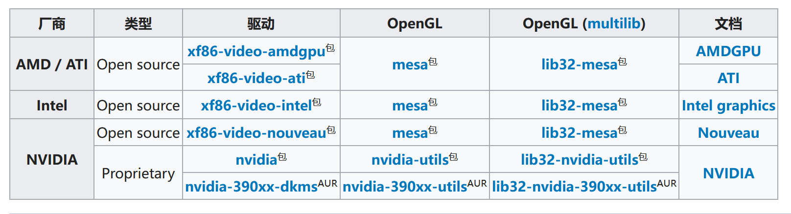

[Arch Linux官网](https://wiki.archlinuxcn.org/wiki/%E5%AE%89%E8%A3%85%E6%8C%87%E5%8D%97)

### 联网
---

```
ip link

rfkill
```

```
iwctl

help

station list

station <wlan> scan

station <wlan> get-networks

station <waln> connect <name>

quit / exit

ping baidu.com
```

### 更新系统时间
---

    timedatectl set-ntp true

    timedatectl status


### 硬盘分区
---

    fdisk -l

    fdisk

| 挂载点    | 分区      | 分区类型     | 建议大小 |
|-----------|-----------|--------------|----------|
| /mnt/boot | /dev/sda1 | EFI系统分区  | > 300M   |
| [SWAP]    | /dev/sda2 | Linux swap   | > 512M   |
| /mnt      | /dev/sda3 | Linux x86-64 | 剩余空间 |

格式化分区

    mkfs.fat -F32 /dev/sda1

    mkfs.ext4 /dev/sda3

    mkswap /dev/sda2

    swapon /dev/sda2

挂载分区

    mount /dev/sda3 /mnt

    mount --mkdir /dev/sda1 /mnt/boot

换源

    vim /etc/pacman.conf                (打开 Color,可以在安装软件的时候打印一些提示)

    vim /etc/pacman.d/mirrorlist

> Server = https://repo.huaweicloud.com/archlinux/$repo/os/$arch
>
> Server = https://mirrors.tuna.tsinghua.edu.cn/archlinux/$repo/os/$arch

    pacman -Syyu

### 安装开始

    pacstrap /mnt base linux linux-firmware base-devel

    pacstrap /mnt networkmanager dhcpcd vim

生成分区表

    genfstab -U /mnt >> /mnt/etc/fstab

进入新系统

    arch-chroot /mnt

设置时区

    ln -sf /usr/share/zoneinfo/Asia/Shanghai /etc/localtime

设置硬件时间

    hwclock --systohc

本地化设置

    vim /etc/locale.gen
    # en_US.UTF-8 UTF-8


    locale-gen

    echo LANG=en_US.UTF-8 >> /etc/locale.conf

    vim /etc/hostname
    yrxns


    vim /etc/hosts
    127.0.0.1    localhost
    ::1        localhost
    127.0.1.1    yrxns.localdomain    yrxns

设置root用户的密码

    passwd

查看cpu和显卡信息

    pacman -S neofetch

    neofetch

    pacman -S intel-ucode

    pacman -S amd-ucode

UEFI启动模式

    pacman -S grub efibootmgr

    mkdir /boot/grub

    uname -m（确定系统架构）

    grub-install --target=x86_64-efi --efi-directory=/boot --bootloader-id=GRUB

    grub-mkconfig -o /boot/grub/grub.cfg

退出新系统

    exit

退出挂载

    umount -R /mnt

重启

    reboot


---


### Arch Linux

联网

    systemctl start  NetworkManager

    systemctl enable NetworkManager

    systemctl start  dhcpcd

    systamctl enable dhcpcd

    然后用nmcli或nmtui（推荐）联网就可以了

安装 man 手册

    pacman -S man

创建一个普通用户

    useradd -m -G wheel yrxns

    passwd yrxns

    ln -s /usr/bin/vim /usr/bin/vi

    visudo
    # %wheel ALL=(ALL) ALL


换源和更新系统

    vim /etc/pacman.d/mirrorlist

     Server = https://repo.huaweicloud.com/archlinux/$repo/os/$arch

     Server = https://mirrors.tuna.tsinghua.edu.cn/archlinux/$repo/os/$arch

    pacman -Syyu

git

    sudo pacman -S git

    git config --global user.name "yrxns"

    git config --global user.email "819924033@qq.com"

    vim ~/.gitconfig

    ssh-keygen -t rsa -C "819924033@qq.com"

    cat ~/.ssh/id_rsa.pub

    ssh -T git@github.com


yay

    git clone https://github.com/Jguer/yay.git

    cd yay-bin

    makepkg -si

### 桌面环境

安装显卡驱动



    sudo pacman -S xf86-video-intel

Xorg桌面服务

    sudo pacman -S xorg xorg-server xorg-xinit

fish

    sudo pacman -S fish

    chsh -l

    chsh -s /bin/fish


Hack字体

[nerd-fonts](https://github.com/ryanoasis/nerd-fonts#option-2-release-archive-download)

    wget https://github.com/ryanoasis/nerd-fonts/releases/download/v3.0.1/Hack.tar.xz

    sudo apt install unar

    unar Hack.tar.xz

    tar -xf Hack.tar.xz

    cp -r Hack/  ~/.local/share/fonts/

    cp -r Hack/  /usr/local/share/fonts/

    fc-cache -f -v

    fc-list | grep "Hack"

    sudo setfont ~/.local/share/fonts/Hack

    vim ~/.fishrc
    sudo setfont ~/.local/share/fonts/Hack
    fc-cache -f -v

>检查能否正常显示小图标

[cheat-sheet](https://www.nerdfonts.com/cheat-sheet)

dwn

    sudo pacman -S w3n

    mkdir ~/suckless

    cd ~/suckless

    git clone https://git.suckless.org/dwm
